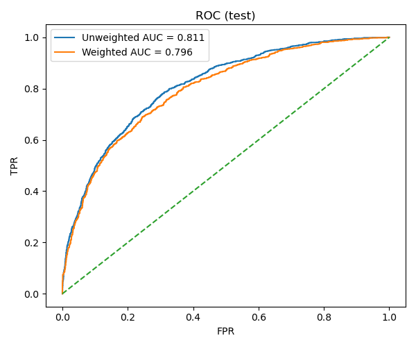
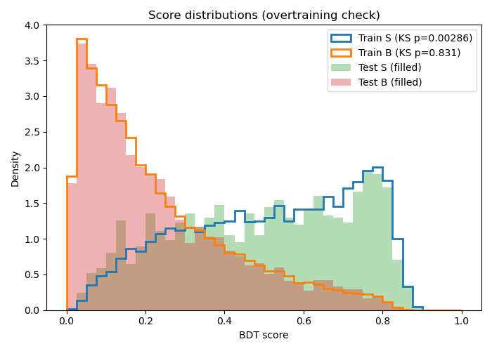
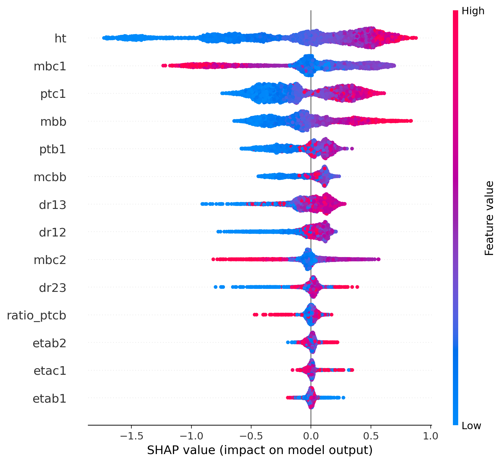
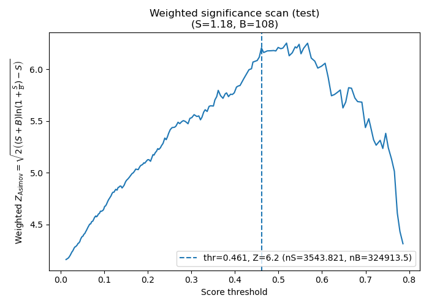

# Signal–Background Classification Pipeline with XGBoost (High Energy Physics Case Study)

This repository implements an end-to-end, reproducible pipeline for **signal vs background classification** in high-energy physics using **XGBoost (BDT)**.

It is designed with:
- **physics correctness** (cross sections, luminosity, significance)
- **ML engineering best practice** (clean splits, reproducibility, CI)
- **industry-style structure** (config-driven, versioned releases, reports)

The example use case is a BSM Higgs signal at **m\_H = 200 GeV** (use **m** for simplicity), but the pipeline is mass-agnostic. 

This project demonstrates how I design, implement, and productionize end-to-end machine learning pipelines on large scientific datasets.

---

## Repository structure

```text
.
├── LICENSE
├── README.md
├── MODEL_CARD.md
├── src/                    # Python pipeline code
├── configs/                # path.yaml, path.ci.yaml, etc.
├── docs/
│   ├── figures/            # Curated figures for README (tracked)
│   ├── reports/            # Latest inference reports (tracked)
│   └── weights_and_metrics.md
├── sampledata/             # Small ROOT samples for CI / demo (tracked)
├── rawdata/                # Full ROOT samples (NOT tracked)
├── ml_outputs/             # Generated parquet + splits (ignored)
├── ml_models/              # Working + frozen models (ignored)
├── ml_ablation/            # Feature ablation outputs (ignored)
├── .github/workflows/      # CI
├── Makefile
├── environment.yml
└── requirements.txt
```
---

## Installation
### Option 1 — pip (recommended for CI / quick use)
```bash
pip install -r requirements.txt
```

### Option 2 — conda (full environment)
```bash
conda env create -f environment.yml
conda activate hep-ml
```

Note: ROOT is only required if you want to regenerate ROOT samples.
The provided sampledata/ is sufficient to run the full pipeline and CI.

---

## Quickstart (recommended)
Run the full pipeline:
```bash
make all
```

Run a fast CI/demo pipeline using the tracked sampledata/:
```bash
make ci
```

### Common steps:
```bash
make data       # ROOT -> parquet
make splits     # train/val/test splits
make train      # train BDT
make ablation   # drop-1 feature ablation
make optimal    # select optimal feature set
make freeze     # freeze versioned release
make infer      # inference on test split
make summarize  # write latest report (md + json)
```

---

## Data configuration
Paths to ROOT files are configured via YAML:

configs/path.yaml → full dataset (rawdata)

configs/path.ci.yaml → small demo dataset (sampledata, used in CI)

Example:
```yaml
data_root: rawdata
fallback_data_root: sampledata

signal:
  sig_200:
    - sig_200.root

background:
  bbj:
    - bkgbbj1.root
  ccj:
    - bkgccj1.root
  bbc:
    - bkgbbc1.root
```
The pipeline will automatically fall back to sampledata/ if rawdata/ is not present.

---

## Sample Data

Small ROOT samples are included under `sampledata/` for demonstration and CI:

- signal: ~2,000 events  
- background: ~3,000 events (combined)

Full datasets (multi-million events; hundreds of GB) are intentionally **not tracked** in this repository, but can be regenerated locally using the provided scripts.

This design keeps the repository lightweight while preserving full reproducibility.

---

## Pipeline Overview
### 1) make_dataset.py
Reads ROOT files, applies event selection, writes flat parquet datasets.

### 2) prepare_ml.py
Builds train/val/test splits and records weighted fractions.

### 3) train_bdt.py
Trains XGBoost classifier (unweighted training).

### 4) feature_ablation.py / run_optimal_ablation.py / plot_bdt_diagnostics.py
Drop-1 feature ablation, optimal feature set selection and generates diagnostics plots.

### 5) freeze_final.py
Freezes a versioned release: ml_models/final/sig{MASS}_v{N}.

### 6) predict.py
Runs inference using the frozen model.

### 7) summarize_inference.py
Produces human-readable + machine-readable reports:
  - docs/reports/report_infer_test_sig200.latest.md
  - docs/reports/report_infer_test_sig200.latest.json

---

## Latest Results (m = 200 GeV)
Human-readable summary:  
- 📄 [report_infer_test_sig200.latest.md](docs/reports/report_infer_test_sig200.latest.md)

Full JSON report:  
- 🗂️ [report_infer_test_sig200.latest.json](docs/reports/report_infer_test_sig200.latest.json)

---

## Selected Figures
The figures below are curated copies produced during the freeze/finalize step and stored under docs/figures/ for stable GitHub rendering.

### ROC (test)



### Train vs Test Score Distributions



### SHAP Summary



### Z Scan (test)



---

## Weights and Significance
This pipeline uses two weights:
  - gen_weight: generator-level MC weight
  - sample_weight: physics-normalized weight (includes luminosity)

Z\_Asimov significance is computed as:

Z = sqrt( 2 * [ (S + B) * ln(1 + S / B) - S ] )

A detailed explanation is provided here:
- 📘 [Weights and metrics explanation](docs/weights_and_metrics.md)

---

## Design principles
- Training is performed on unweighted data to avoid bias.
- Physics normalization is applied only during evaluation.
- Models are frozen into versioned releases (sig200_v1, sig200_v2, …).
- Heavy artifacts are not committed; curated reports and figures are tracked.

---

## Continuous Integration

GitHub Actions runs a full smoke pipeline using `sampledata/`:

- dataset generation
- splits
- training
- inference
- report generation

This ensures the repository is always reproducible and executable.

---

## Regenerate Sample ROOT Files (optional, advanced)

If you have ROOT installed and want to regenerate the sample ROOT files:

```bash
g++ -O3 scripts/cut_delphes_tree.cpp \
  -o scripts/cut_delphes_tree \
  $(root-config --cflags --libs)

python scripts/make_root_sample.py
```

---

## Reproducibility

- All paths are centralized in `configs/path.yaml`
- CI sample paths are defined in `configs/path.ci.yaml`
- Random seeds are fixed
- Splits are deterministic
- Evaluation metrics use physics weights; training is ML-standard

---

## What this project demonstrates

- Large-scale scientific data processing (ROOT → parquet)
- End-to-end ML system design (reproducible training + frozen inference artifacts)
- Robust evaluation (AUC + significance scans)
- Model interpretability (permutation importance + SHAP)

---

## Industry Relevance

While this project is rooted in high-energy physics, it demonstrates industry-relevant skills including:

- large-scale tabular data processing (ROOT → parquet)
- feature engineering on high-dimensional data
- supervised classification with severe class imbalance
- reproducible ML pipelines with CI
- model versioning and frozen inference artifacts
- interpretability (SHAP, ablation)
- metric-driven optimization

These patterns directly translate to applications in finance, healthcare, recommendation systems, and anomaly detection.

---

## Related Publication

This pipeline is based on and extends the methodology developed in:

Chenyu Fang, Wei-Shu Hou, Chung Kao and Mohamed Krabg, *Enhanced Charged Higgs Signal at the LHC*, arXiv:2511.19604 [hep-ph], 2025.  
https://doi.org/10.48550/arXiv.2511.19604

---

## Contact

For questions or collaboration inquiries, please open an issue or contact:
Chenyu Fang — fchy19960519@gmail.com
